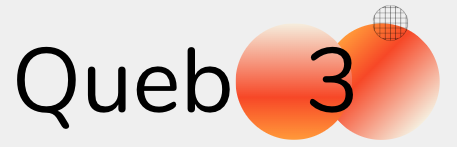
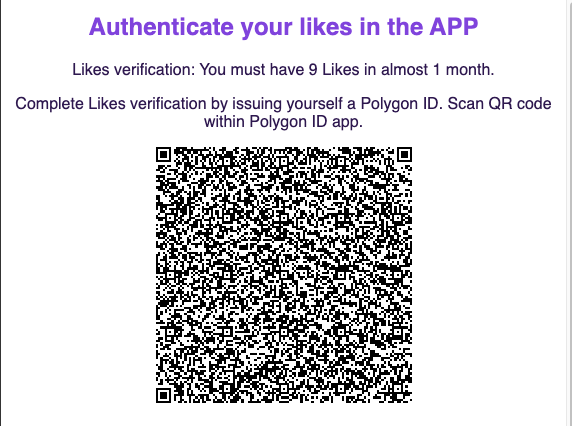
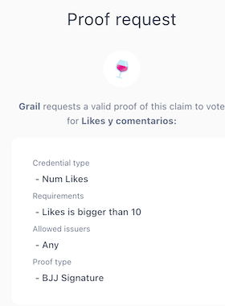
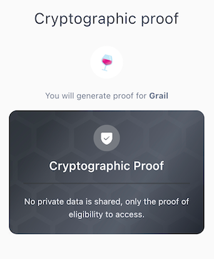
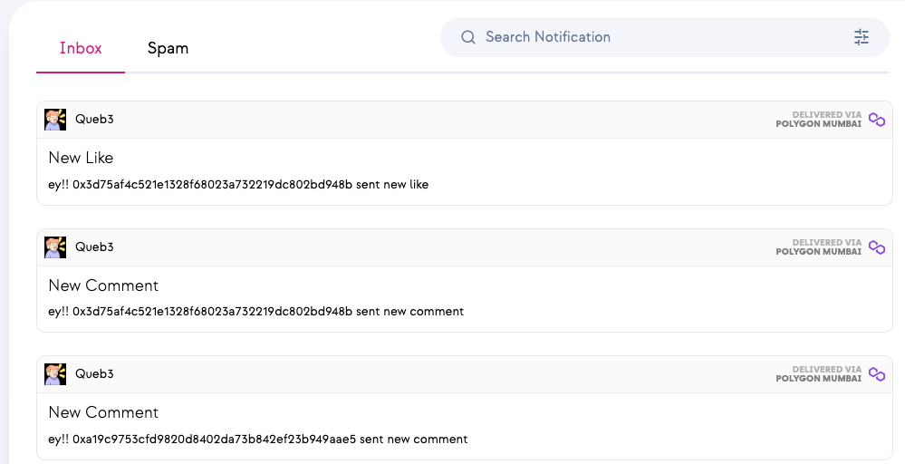
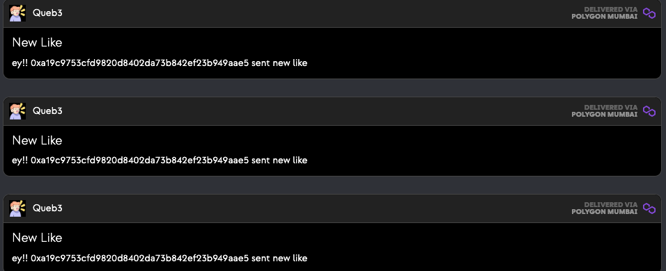

# Queb3

     
    
     

> A decentrilized Quora usingn the Lens Protocol

## Relevant links

| What? | Link |
|---|---|
| Landing Page | https://queb3.vercel.app/ |
| Polygon ID SC |0x90e8c54369310031F4B40A75B124A924E1AEA9b1 |
| Polygon Validate Wallet |Into the readme* |
| Add NumLikes to Polygon Wallet | https://platform-test.polygonid.com/claim-link/8c061bb9-c3a5-4811-82bf-3566d0e3440e |
| Push Protocol SC | 0xFF9d3FD89cf965748222de08A9d6b24DCa878c09 |
| Push Protocol Page | https://staging.push.org/#/channels |
| Push Channel | 0x3D75aF4c521E1328f68023a732219DC802bD948b |

This starter kit is composed of Next.js and Tailwind CSS, with RainbowKit, ethers, & wagmi for all your web3 needs. It uses Typescript and an opinionated directory structure for maximum dev confy-ness.

## Getting Started

First, install dependencies with `yarn install`. Then, initialize the env file with `cp .env.example .env`, and add your Infura & web3.storage credentials. Finally, run the development server with `yarn dev`.

Open [http://localhost:3000](http://localhost:3000) with your browser to see the result.

### Polygon ID 

     
    
     

     
    
     

     
    
     

### Push Protocol 

     
    
     

     
    
     

## License

This app is open-source and licensed under the MIT license. For more details, check the [License file](LICENSE).
